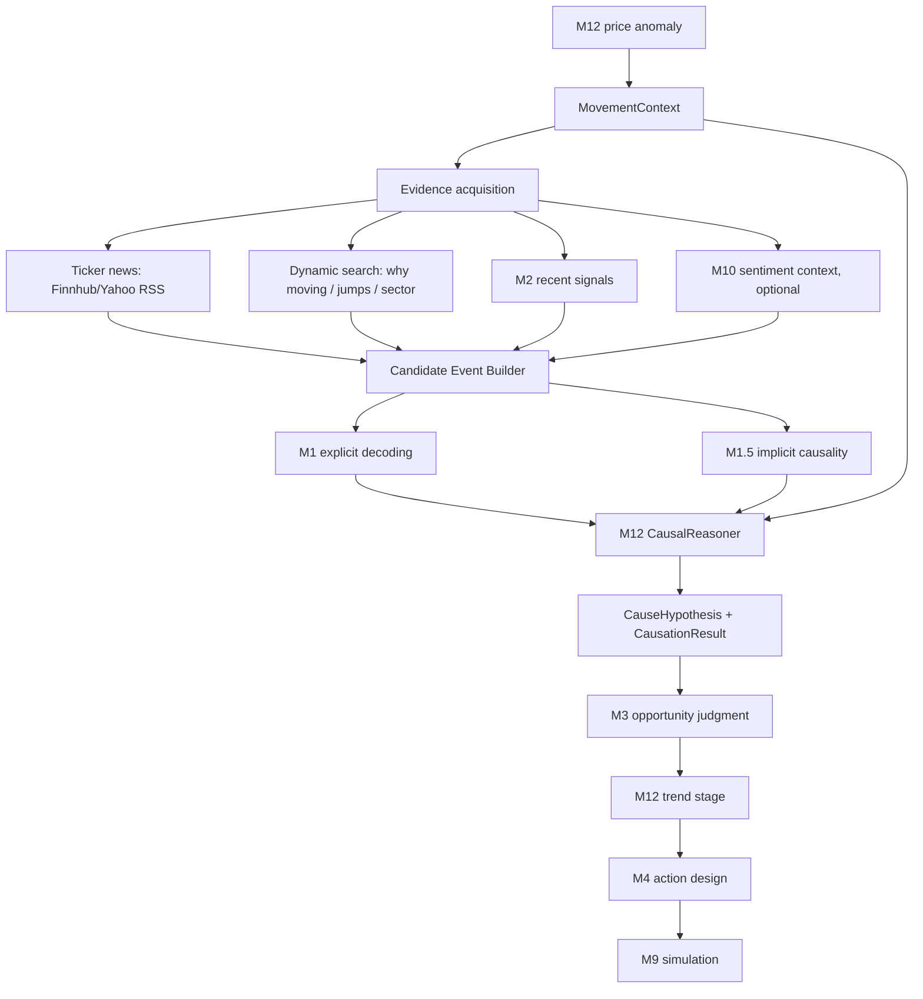

# M12 Track 2 Iteration Plan: Price-Driven Causal Explanation

> Date: 2026-05-18
> Status: design ready, not implemented
> Revision: v2.1, P0 scope reduced after review
> Scope: M12 price-driven anomaly track, especially US/HK anomaly causation

## 1. Executive Summary

Track 2 is the price-driven path:

```text
price anomaly -> cause tracing -> opportunity judgment -> action design -> paper trade
```

The current implementation can detect US intraday anomalies, but most of them stop at the causation stage because the system treats "no decoded news signal" as "no cause". That works for A-share ticker news, but fails for US/HK because the evidence source and causal form are different:

- US/HK ticker news source is incomplete without Finnhub/Yahoo ticker RSS/search.
- Many US moves are explained by sector, supply chain, policy, social momentum, options flow, or liquidity rather than a direct company headline.
- M1 `MarketSignal` extraction is useful, but it is too narrow to be the only representation of an anomaly cause.

The v2 target is to upgrade M12 from a "news lookup gate" into a "market narrative reconstruction layer":

```text
M12 anomaly
  -> MovementContext
  -> directed evidence search
  -> candidate event building
  -> causal reasoning
  -> CauseHypothesis / CausationResult
  -> M3 opportunity judgment
  -> M12 trend stage
  -> M4 action
  -> M9 simulation
```

The implementation should not rewrite M3, M4, or M9. M12 remains a trigger/orchestration layer. M13 provides reusable active search and research capabilities. M3 remains the final opportunity judgment module.

### v2.1 Revision: keep the blueprint, shrink P0

The full v2 blueprint still targets `MovementContext`, `EvidenceBundle`, `CauseHypothesis`, and eventually `M13.search_movement_evidence()`. However, P0 should not implement all abstractions at once.

P0 is now deliberately smaller:

```text
M12 _collect_and_decode_news()
  -> add Yahoo per-ticker RSS for US/HK
  -> use Finnhub only when FINNHUB_API_KEY exists
  -> keep existing M1 decode
  -> keep existing _fallback_simple_signals() when raw articles exist but M1 returns no signals
  -> only return unexplained when no usable raw evidence exists
```

This is enough to break the current zero-conversion failure mode without prematurely freezing shared schemas or forcing M13 into a path where it has no real search implementation yet.

## 2. Current v1 Chain and Breakpoint

Current M12 chain:

```text
M12 AnomalyDetector
  -> BackwardCausation.trace()
     -> find related M2 signals
     -> collect ticker news
     -> M1 decode news into MarketSignal
     -> query M2 supplement
     -> if no MarketSignal cause: unexplained
  -> M3 judge
  -> TrendAssessor
  -> RetroOpportunity
```

Observed US failure mode:

```text
FutuOpenD intraday scan finds 9-13 US anomalies
  -> DataProviderManager.get_news("AAPL") returns empty
     -> A-stock provider cannot resolve US ticker
     -> RSS provider is feed-oriented, not ticker search
  -> Finnhub fallback requires FINNHUB_API_KEY and is often unavailable
  -> no news
  -> no M1 decoded signal
  -> causation_type="unexplained"
  -> M12 skips before M3
```

This creates a structural zero-conversion path:

```text
anomaly detected -> no direct ticker news -> no MarketSignal -> no cause -> no M3 -> no opportunity
```

## 3. Design Principles

1. Price confirms that something happened, not that it remains tradable.
2. M12 must require evidence, but evidence is broader than direct ticker news.
3. A cause is not always a standard `MarketSignal`.
4. M12 should not bypass M3; M3 remains the opportunity judge.
5. M13 should not replace M12; it supplies active search and research infrastructure.
6. M1 should still decode explicit news when possible.
7. M1.5 should evaluate implicit cross-asset and sector causality.
8. No-news moves may be tracked as flow/momentum hypotheses, but with restricted downstream permissions.
9. Every accepted or rejected anomaly must leave an inspectable decision trail.
10. US/HK must have first-class evidence sources; A-share assumptions cannot be reused blindly.

## 4. Target v2 Chain

```text
M12 AnomalyDetector
  -> MovementContext
  -> Evidence Acquisition
       - M13 active search
       - M0/provider ticker news
       - M2 recent signal lookup
       - optional M10 sentiment context
  -> Candidate Event Builder
       - normalize, deduplicate, rank by time/relevance
  -> M1 Decode Explicit News
       - convert suitable items to MarketSignal
  -> M1.5 Implicit Reasoning
       - sector, supply chain, macro, peer sympathy
  -> M12 CausalReasoner
       - choose primary/secondary cause hypotheses
       - classify unexplained / partial / explained
  -> M3 Judgment
       - receives MarketSignal plus movement context and cause hypotheses
  -> M12 TrendAssessor
       - early / middle / late
  -> M4 ActionDesigner
  -> M9 PaperTrader
  -> M6/M8 Review and Knowledge Update
```

Mermaid view:



## 5. Module Boundaries

| Module | Track 2 responsibility | Must not do |
|---|---|---|
| M12 | Detect anomalies, build movement context, orchestrate evidence search, classify causation, assess trend stage | Replace M3 judgment or make final trade decisions |
| M13 | Provide active search/research capability: ticker news, semantic search, research reports, fundamentals, cache | Decide whether an anomaly is an opportunity |
| M0 | Passive feeds and provider wrappers; can expose provider APIs reused by M12/M13 | Own M12 causality policy |
| M1 | Decode explicit articles into `MarketSignal` | Force every anomaly cause into `MarketSignal` |
| M1.5 | Infer implicit links: sector, supply chain, policy, peer sympathy | Execute trades or override M3 |
| M2 | Store and query signals/cases/causal patterns | Become the only evidence source for fresh anomalies |
| M3 | Final opportunity judgment from signals and context | Search the web or fetch raw evidence |
| M4 | Action plan, position sizing, stop loss/take profit | Override M12 causation or M3 opportunity thesis |
| M10 | Sentiment context for calibration | Directly trigger opportunities |
| M11 | Offline calibration/verification | Production judgment input until calibrated |

## 6. Data Model Additions

These models describe the target design. They should not all be implemented in P0.

Implementation rule:

- P0: use the existing `MarketSignal` fallback path plus small local helpers/dicts/dataclasses inside M12 if needed.
- P1: introduce local M12 dataclasses for `MovementContext` and `EvidenceBundle` only after real logs show the fields are stable.
- P1/P2: introduce `CauseHypothesis` when M3 actually needs to consume non-`MarketSignal` causes.
- Shared `core.schemas` should be updated only after a model is consumed across module boundaries or persisted.

### 6.1 MovementContext

Purpose: the structured description of the price event being explained.

```python
class MovementContext(BaseModel):
    movement_id: str
    instrument: str
    market: Market
    company_name: str | None = None
    sector: str | None = None
    industry: str | None = None
    themes: list[str] = []

    anomaly_type: AnomalyType
    event_time: datetime
    scan_time: datetime
    price_change_pct: float
    intraday_high_change_pct: float | None = None
    volume_ratio: float
    atr_multiple: float
    sigma_multiple: float
    baseline_price: float | None = None
    anomaly_price: float | None = None

    search_window_hours: int = 48
    direction: Direction
    raw_anomaly_id: str
```

### 6.2 EvidenceItem

Purpose: normalize evidence from news, search results, M2 signals, M10, or future options/social sources.

```python
class EvidenceItem(BaseModel):
    evidence_id: str
    source: str
    source_type: Literal[
        "ticker_news",
        "search_result",
        "rss",
        "m2_signal",
        "sentiment",
        "research_report",
        "fundamental",
        "social",
        "options_flow",
        "price_only",
    ]
    title: str
    summary: str = ""
    content: str = ""
    url: str | None = None
    published_at: datetime | None = None
    retrieved_at: datetime

    instruments: list[str] = []
    sectors: list[str] = []
    themes: list[str] = []
    raw_payload: dict = {}

    relevance_score: float = 0.0
    freshness_score: float = 0.0
    credibility_score: float = 0.0
```

### 6.3 EvidenceBundle

Purpose: the evidence package returned by the evidence acquisition layer.

```python
class EvidenceBundle(BaseModel):
    movement: MovementContext
    items: list[EvidenceItem]
    searched_queries: list[str] = []
    providers_used: list[str] = []
    providers_failed: dict[str, str] = {}
    partial_result: bool = False
    timeout: bool = False
```

### 6.4 CauseHypothesis

Purpose: represent a plausible cause even when it is not a standard `MarketSignal`.

```python
class CauseHypothesis(BaseModel):
    hypothesis_id: str
    instrument: str
    market: Market
    cause_type: Literal[
        "earnings",
        "guidance",
        "analyst",
        "mna",
        "product",
        "regulatory",
        "macro",
        "policy",
        "supply_chain",
        "sector_sympathy",
        "peer_readthrough",
        "social_sentiment",
        "short_squeeze",
        "options_flow",
        "technical_breakout",
        "liquidity",
        "momentum",
        "unknown",
    ]
    direction: Direction
    summary: str
    causal_chain: str
    evidence_ids: list[str]

    confidence: float
    relevance_to_move: float
    persistence: Literal["one_time", "short_lived", "continuing", "uncertain"]
    tradability: float
    can_feed_m3: bool = True
    max_allowed_priority: Literal["watch", "research", "position", "urgent"] = "research"
```

### 6.5 CausalReasoningResult

Purpose: bridge the new cause hypothesis world back to existing M12 `CausationResult`.

```python
class CausalReasoningResult(BaseModel):
    movement: MovementContext
    evidence_bundle: EvidenceBundle
    primary_cause: CauseHypothesis | None
    secondary_causes: list[CauseHypothesis] = []
    decoded_signals: list[MarketSignal] = []

    causation_type: Literal[
        "direct_news",
        "implicit_sector",
        "macro_policy",
        "sentiment_flow",
        "technical_flow",
        "mixed",
        "unexplained",
    ]
    confidence: float
    unexplained_ratio: float
    decision: Literal["proceed_to_m3", "watch_only", "drop"]
    skip_reason: str = ""
```

## 7. Evidence Acquisition Strategy

### 7.1 Default provider order

For US/HK, use the following order:

1. Finnhub company news if `FINNHUB_API_KEY` is configured.
2. Yahoo Finance per-ticker RSS, no key required.
3. Existing RSS/news providers as broad market context.
4. Dynamic search provider: DuckDuckGo initially; Bing/NewsAPI can replace or supplement later.
5. M2 recent signals for macro/sector background.

For A-share, keep the existing A-stock path:

1. AStockSkill/EastMoney ticker news.
2. M2 recent signals.
3. Optional dynamic search only if direct ticker news is empty or stale.

### 7.2 Query construction

Direct ticker queries:

```text
{ticker} stock why moving today
{ticker} shares jump today
{ticker} stock falls after
{company_name} stock news today
{ticker} unusual volume today
```

Sector/theme queries:

```text
{sector} stocks moving today
{theme} stocks rally today
{theme} regulation news
{peer_ticker} guidance {ticker}
{supplier_or_customer} news {ticker}
```

The phrase `why moving` should be used as a helper query, not the only query. It can catch market commentary articles, but it often misses the real cause when the driver is a peer, macro, supply chain, or policy event.

### 7.3 Search expansion defaults

Use at most three search rounds per anomaly in v2:

| Round | Trigger | Query count | Goal |
|---|---|---:|---|
| R1 ticker direct | Always | 2-3 | Fast direct explanation |
| R2 sector/theme | R1 weak or no direct cause | 2-4 | Capture sympathy and macro/industry drivers |
| R3 flow/momentum | No news but strong price/volume | 1-2 | Classify technical, squeeze, social, or liquidity move |

### 7.4 Ranking defaults

Rank evidence by:

```text
final_score =
  0.35 * relevance_to_ticker
  + 0.25 * freshness
  + 0.20 * source_credibility
  + 0.10 * direction_match
  + 0.10 * theme_match
```

Default freshness windows:

- Intraday anomaly: last 24 hours preferred, up to 72 hours allowed.
- Daily anomaly: last 5 trading days.
- Earnings/guidance: latest report window may override freshness if the price move is delayed.

## 8. Causal Reasoning Policy

### 8.1 Evidence classes

| Evidence class | Can become `MarketSignal` | Can become `CauseHypothesis` | Notes |
|---|---:|---:|---|
| Earnings/guidance/news | Yes | Yes | Preferred direct cause |
| Analyst upgrade/downgrade | Yes | Yes | Usually short-lived but tradable |
| Macro/policy | Yes | Yes | Often needs M1.5 link to ticker |
| Peer/supply chain | Sometimes | Yes | M1.5 should validate implicit link |
| Social/meme | Rarely | Yes | Restrict priority without strong evidence |
| Options/flow | Rarely | Yes | Needs future data source |
| Pure technical breakout | No | Yes | Watch/research only by default |
| Unknown/no evidence | No | No | Drop unless explicitly watch-only |

### 8.2 Decision rules

Proceed to M3 when:

- At least one `CauseHypothesis.confidence >= 0.45`, and
- `relevance_to_move >= 0.5`, and
- evidence is not older than the configured window, and
- either decoded signals exist or the hypothesis has enough structured narrative.

Watch only when:

- no direct news exists, but price/volume signal is strong, or
- social/flow/technical cause is plausible but unverified, or
- evidence is directionally relevant but source credibility is weak.

Drop when:

- evidence is empty and price/volume strength is not exceptional,
- all evidence is stale or unrelated,
- causal direction contradicts the move without a plausible reversal explanation,
- the only explanation is generic market movement with no ticker/sector specificity.

### 8.3 No-news restricted allow

No-news does not always mean no cause. However, no-news causes must be constrained:

```text
Cause types allowed without news:
  - technical_breakout
  - momentum
  - liquidity
  - short_squeeze
  - options_flow, when future source exists
  - social_sentiment, when future source exists

Default downstream cap:
  max_allowed_priority = "research"

Default action:
  proceed_to_m3 only as watch/research context
  never direct position/urgent without additional evidence
```

This preserves M12's principle that "unexplained chasing is gambling" while avoiding systematic blind spots in US intraday moves.

## 9. M3 Input Contract

M3 should receive three layers:

1. `MarketSignal[]` decoded by M1 when available.
2. `CauseHypothesis[]` as structured movement explanation context.
3. `MovementContext` as price confirmation context.

M3 should not fetch raw evidence. It should judge whether the hypothesis plus signals form an investable opportunity.

Recommended prompt framing:

```text
You are judging whether a price-confirmed anomaly has remaining tradable opportunity.
Price movement is confirmation that something happened, not proof of future continuation.
Evaluate:
  - cause quality
  - persistence
  - remaining upside/downside
  - tradability
  - risks and invalidation
Respect max_allowed_priority from M12 for weak/no-news causes.
```

This is not a boundary violation because M3 is not doing price scanning or evidence search. It is consuming structured context produced by M12/M13.

## 10. M13 Role in Track 2

M13 is the long-term home for reusable active search, ranking, cache, and research workflows. It should eventually expose a lightweight evidence search entrypoint for M12:

```python
def search_movement_evidence(
    context: MovementContext,
    max_items: int = 12,
    timeout_seconds: int = 20,
) -> EvidenceBundle:
    ...
```

This should be separate from `standard_research()` because the M12 causation stage needs fast evidence for explanation, not a full research report.

However, this is not a P0 dependency. Current M13 has the cache/research framework, but not the concrete Yahoo/Finnhub/DDG movement-search implementation. P0 should therefore call Yahoo/Finnhub directly from M12. M13 migration starts in P1/P2 when dynamic search, query caching, provider ranking, and cross-module reuse become valuable.

Recommended internal M13 split:

```text
ResearchAgent
  - quick_research()
  - standard_research()
  - deep_research()
  - search_movement_evidence()  # new lightweight path
```

`standard_research()` remains useful after a preliminary cause exists and M12/M3 need validation. It should not be the only way M12 asks for evidence.

## 11. Implementation Phases

### P0: Restore US/HK causation viability

Goal: stop all US/HK anomalies from dying at "no direct news".

Changes:

- Add Yahoo Finance per-ticker RSS fetch for US/HK inside M12's current news collection path.
- Use Finnhub company news only when `FINNHUB_API_KEY` exists; missing key must not raise noisy errors or block fallback.
- Keep the current M1 decode path for raw articles.
- Keep the current `_fallback_simple_signals()` path when raw articles exist but M1 returns no signals.
- Do not add shared schemas in P0.
- Do not require M13 in P0.
- Add lightweight logs for providers tried, provider failures, raw article count, decoded signal count, and fallback signal count.

Acceptance:

- AAPL/NVDA/TSLA sample anomalies fetch raw articles from Yahoo ticker RSS without Finnhub key.
- Missing Finnhub key degrades to Yahoo RSS without throwing.
- If raw articles exist, M12 no longer returns `unexplained` solely because M1 decoded zero signals.
- If both Yahoo and Finnhub return no articles, `unexplained` remains valid.
- Some US anomalies proceed to M3 as weak `event_driven` fallback signals; M3 may still reject them.

### P1: Dynamic search

Goal: find causes outside direct ticker pages.

Changes:

- Introduce local `MovementContext` and `EvidenceBundle` dataclasses if P0 logs show they remove real complexity.
- Add DuckDuckGo search adapter or a provider interface compatible with future Bing/NewsAPI.
- Generate ticker direct and sector/theme queries.
- Normalize search results into `EvidenceItem`.
- Add relevance ranking and duplicate removal.
- Cache query results for 30-60 minutes per ticker/query.
- Decide whether M13 should own `search_movement_evidence()` once concrete search behavior exists.

Acceptance:

- Sector/macro explanations can be found for semiconductor, AI, tariff, rate, and FDA style moves.
- Per anomaly search stays within configured timeout.
- Query logs are visible in decision records.

### P2: Industry and peer expansion

Goal: capture supply chain and peer readthrough.

Changes:

- Audit `data/industry_graph_full.json` for US coverage before relying on it. Current samples are A-share/Chinese-industry heavy.
- Add fallback ticker-theme map for US mega caps and high-frequency movers before enabling US sector expansion.
- Search peer/supplier/customer themes when direct ticker evidence is weak.
- Let M1.5 score implicit relevance between candidate event and anomaly ticker.
- Introduce `CauseHypothesis` once non-direct causes need to be passed to M3 without forcing them into `MarketSignal`.

Acceptance:

- AAPL can be explained by iPhone/Foxconn/TSMC/China demand evidence.
- NVDA/AMD/SOXX moves can be explained by chip policy or peer guidance.
- CauseHypothesis records the implicit causal chain clearly.

### P3: Flow, social, and options extensions

Goal: handle US intraday anomalies that are not news-driven.

Potential sources:

- Unusual options activity API.
- Reddit/WSB or social trend search.
- Short interest / borrow / float metadata.
- Intraday technical pattern classification.

Policy:

- These sources may generate `CauseHypothesis`.
- Default cap remains `research` unless multiple independent sources confirm the move.
- M9 simulation can paper-trade watch/research cases separately for calibration.

## 12. Operational Defaults

| Setting | Default |
|---|---:|
| Max anomalies per scan to trace | 15 |
| P0 evidence timeout per ticker | 10 sec |
| P1 dynamic search timeout per ticker | 20 sec |
| Max evidence items passed to LLM | 12 |
| Max decoded articles per anomaly | 5 |
| Search cache TTL | 30-60 min |
| Finnhub rate budget | <= 30 req/min |
| Default no-news priority cap | research |
| Default no-news action | watch/research only |

## 13. Metrics and Acceptance

Primary metrics:

- US anomaly causation non-empty rate.
- `unexplained` rate by market.
- M12 anomalies reaching M3.
- M3 opportunity conversion rate from M12 inputs.
- False-positive rate from M12-origin opportunities.
- Average trace latency per anomaly.
- Provider success/failure counts.
- Cache hit rate.

Initial target:

```text
US intraday scan:
  before: 9-13 anomalies -> 0 opportunities, mostly unexplained
  after P0/P1: at least 30%-50% anomalies produce non-empty evidence,
               at least some proceed to M3,
               opportunities may still be zero if M3 rejects them.
```

The first success condition is not "force opportunities"; it is "stop losing all anomalies before M3".

## 14. Required Documentation Updates

Update these documents when implementation begins:

- `STANDARD_PIPELINE.md`: add Track 2 v2 and preserve v1 historical chain.
- `m12_opportunity_catcher/DESIGN.md`: add v2 causation design and data models.
- `m13_research/DESIGN.md`: add `search_movement_evidence()` as P1/P2 target, not P0 dependency.
- `docs/Data_Provider_Architecture.md`: add ticker RSS and dynamic search provider capability.
- `.env.example`: document `FINNHUB_API_KEY`, optional `NEWSAPI_KEY`, optional search provider keys.

## 15. Open Risks

- Search providers may be noisy or rate-limited.
- Free search results may be stale or SEO-heavy.
- LLM causal matching can overfit narratives after the price move.
- No-news technical hypotheses can encourage chasing unless priority caps are enforced.
- M13 currently has partial data implementation; search capability must be made real before it becomes part of P0-like critical path.

## 16. Default Decisions

These defaults are locked for v2 implementation unless explicitly changed:

- P0 uses Yahoo per-ticker RSS directly in M12 as no-key US/HK fallback.
- P0 uses Finnhub company news directly in M12 only when key exists.
- Use dynamic search as P1, not a blocker for P0.
- Add `CauseHypothesis` in P1/P2; do not force every cause into `MarketSignal` once M3 can consume hypotheses.
- Do not require M13 evidence search in P0; migrate to M13 after concrete search/cache/ranking exists.
- Keep M3 as the only opportunity judgment module.
- Keep M10 as auxiliary context and M11 as offline calibration only.
